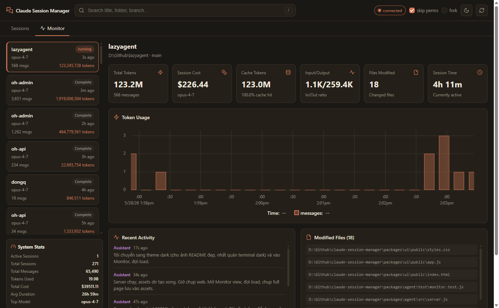
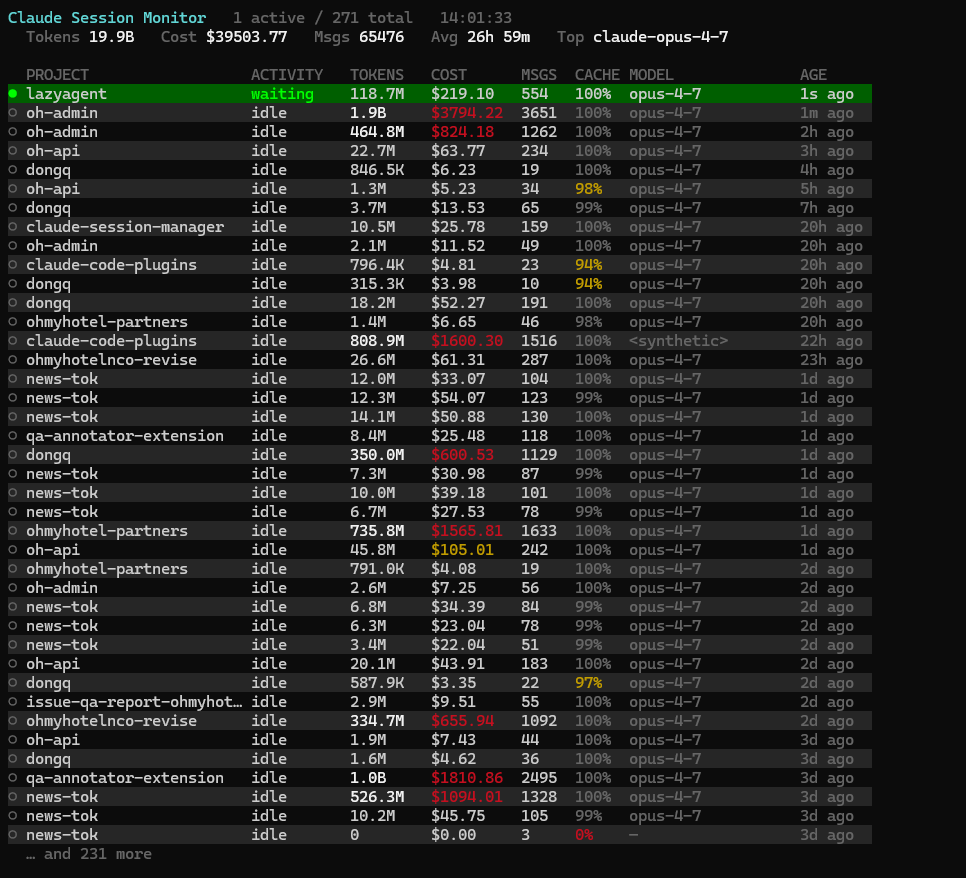
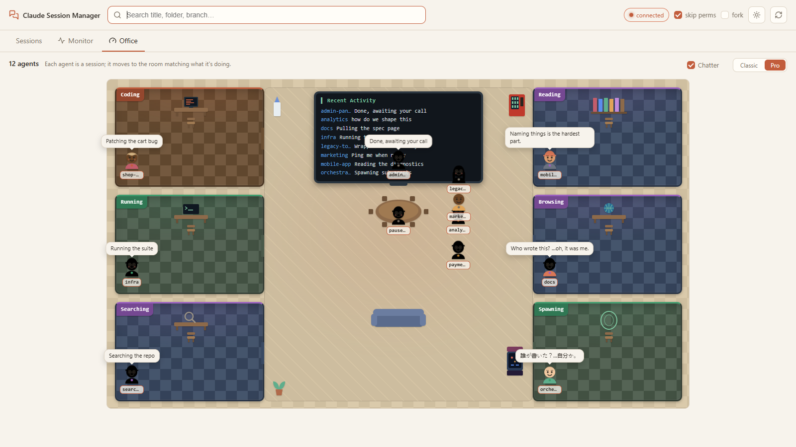
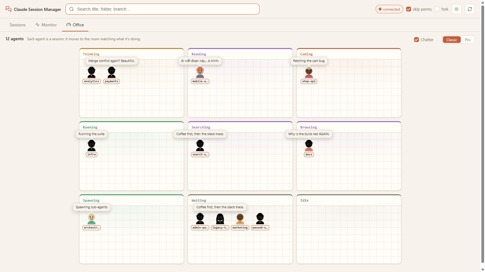

# claude-session-manager

List and instantly reopen any **Claude Code** conversation across all your
folders — without remembering which directory it lived in.

Claude Code stores every conversation under `~/.claude/projects/<folder>/<id>.jsonl`.
To resume one you normally have to remember the folder, open a terminal, `cd`
there, and run `/resume`. With dozens of folders and hundreds of conversations
that gets painful fast. `csm` lists them all in one place and reopens the one
you pick in a new terminal, in the right directory, already resuming.

 

CLI, web UI, and a desktop app — favorites, filters, last-prompt preview,
cross-platform launching, and delete-to-trash with restore. See [PLAN.md](./PLAN.md).

It also includes a **live monitor** for token usage, estimated cost, cache
hit-rate, and per-session activity (thinking / writing / running / …) across
every conversation — in the terminal (`csm monitor`) and in the web UI's
**Monitor** tab, which streams updates over Server-Sent Events.

And just for fun: an **Office** view that renders every conversation as a
little SVG character moving between themed rooms based on what the agent is
doing right now — with a central lounge, a TV showing live Recent Activity,
a pinball cabinet that long-idle agents wander over to play, and optional
multilingual chatter (EN / KR / JP / VN) generated on demand by the local
`claude` CLI. Pick **Pro** (open-plan floorplan, walking avatars) or
**Classic** (simple 9-room grid).

### Web UI — Monitor tab



### Terminal — `csm monitor`



### Web UI — Office tab (Pro)

Six work rooms around a central lounge. Each conversation is an avatar; the
TV shows Recent Activity; the pinball cabinet in the corner takes the
longest-idle agents while everyone else hangs around the meeting table and
sofa. Speech bubbles cycle through real activity lines and multilingual
banter.



### Web UI — Office tab (Classic)

Same data, simpler picture: a 3×3 grid of rooms, one card per activity.
Toggle between Pro and Classic from the segmented control at the top right
of the Office tab.



## Download

**Windows:** grab the installer from the
[latest release](https://github.com/dongquoctien/claude-session-manager/releases/latest)
(`Claude Session Manager Setup *.exe`) and double-click — no Node or terminal
needed.

For the CLI / web UI / other platforms, run from source (below).

## Requirements

- Node.js >= 18
- Claude Code installed (`claude` on your PATH)
- A terminal to open conversations in:
  - **Windows:** Windows Terminal (`wt.exe`) preferred, falls back to PowerShell
  - **macOS:** Terminal.app (via `osascript`)
  - **Linux:** `x-terminal-emulator` (Debian/Ubuntu default-terminal alias)

## Install (local, from source)

```sh
git clone https://github.com/dongquoctien/claude-session-manager
cd claude-session-manager
npm install
```

Run via npm:

```sh
npm run csm -- list
```

Or link the `csm` command globally:

```sh
npm link -w @csm/cli
csm list
```

## Web UI

Prefer a browser over the terminal? Start the local web UI:

```sh
npm run web                 # starts the agent and opens your browser
# or: node packages/agent/bin/csm-web.js [--port 4777] [--no-open]
```

It serves a searchable, folder-grouped list at `http://127.0.0.1:<port>/`.
Type to filter, click a row (or press Enter) to open that conversation in a
new terminal. Tick **fork** to resume as a new forked session.

**Security:** the agent binds `127.0.0.1` only, requires a per-run token
(embedded in the URL it prints/opens), rejects foreign `Host` headers
(anti DNS-rebind), and `POST /api/open` only accepts a sessionId already
present in the scan — it never takes an arbitrary path or command.

## Monitor (tokens, cost & activity)

`csm monitor` (terminal) and the web UI's **Monitor** tab give a live view of
how every conversation is spending tokens:

- **Tokens** — cumulative input / output / cache-write / cache-read.
- **Cost** — *estimated* from token counts × per-model list prices. Claude
  Code's newer transcripts no longer record a cost field, so this is a
  computed estimate, not a billed amount.
- **Cache hit-rate** — `cache_read / (cache_read + input)`. High is good
  (cached context is ~10× cheaper than fresh input); a low rate is flagged.
- **Activity** — derived from the latest transcript entry: `thinking`,
  `writing`, `reading`, `running`, `searching`, `browsing`, `spawning`,
  `waiting`, or `idle`. A session is **active** if it was touched in the last
  60 s.

Metrics are parsed incrementally (mtime + byte-offset cache), so re-scanning
hundreds of conversations on a tight loop only reads the bytes appended since
last time. The web Monitor pushes updates over **Server-Sent Events** as the
`.jsonl` files change; the CLI redraws in an alternate screen buffer (like
`htop`) and only repaints when something actually changed.

> The monitor is read-only observability — it reports usage, it does not cap
> or limit it, and the cost figure is an estimate.

## Desktop app (Electron)

The same UI, in its own window — no browser or terminal needed:

```sh
npm run desktop             # launch the Electron app
npm run desktop:dist        # build a Windows installer (.exe) into
                            # packages/desktop/release/
```

The desktop app just hosts the local agent on a random free port and loads
its token URL in a window — same code, same security model as the web UI.

> Note: in a clean monorepo install, the `app-builder-bin` / `electron`
> binaries occasionally fail to unpack on first `npm install` (network).
> If `desktop:dist` reports a missing `app-builder.exe`, run
> `npm install app-builder-bin --no-save --force` once and rebuild. The
> Electron binary can be fetched via `ELECTRON_MIRROR=https://npmmirror.com/mirrors/electron/`.

## Usage (CLI)

```sh
csm list                 # all conversations, grouped by folder, newest first
csm list news-tok        # filter by a query (title / folder / branch / id)
csm list --fav           # only pinned conversations
csm list --recent 3      # only those touched in the last 3 days
csm list --branch main   # only on a given git branch
csm search dashboard     # same as `list <query>`
csm monitor              # live dashboard: tokens, cost, cache, activity (Ctrl+C quits)
csm monitor --active     # only sessions active right now
csm open <id|prefix>     # open a terminal and resume that conversation
csm fav <id|prefix>      # pin / unpin a conversation
csm rm <id|prefix>       # move to trash (preview; add --yes to confirm)
csm restore <id|prefix>  # restore a trashed conversation
csm trash                # list trash (--empty [--days N] to purge)
csm help
```

Deleting moves the conversation (its `.jsonl` **and** any `<uuid>/` tool-results
directory) into `~/.claude/.csm-trash/` — nothing is `rm`'d, so you can always
`csm restore` it (or Undo in the web UI). Purge with `csm trash --empty`.

Useful flags:

| Flag | Applies to | Meaning |
|------|-----------|---------|
| `--json` | list/search/monitor | machine-readable output |
| `--active` | monitor | only show currently-active sessions |
| `--once` | monitor | print one frame and exit (no live loop) |
| `--interval <ms>` | monitor | refresh interval, min 250 (default 2000) |
| `--limit <n>` | list/search | cap number of rows |
| `--fav` | list | only favorites |
| `--recent [days]` | list | only the last N days (default 7) |
| `--branch <name>` | list | only this git branch |
| `--hide-missing` | list | hide conversations whose folder is gone |
| `--dry-run` | open | print the launch command, don't run it |
| `--fork` | open | resume with `--fork-session` (new id, keeps history) |
| `--safe` | open | keep permission prompts (skip is on by default) |
| `--terminal <wt\|powershell>` | open | force a terminal (default: auto) |
| `--folder <slug-substr>` | open/fav/rm | pick a copy by folder when one id exists in two folders (worktree duplicates) |
| `--yes` / `-y` | rm | actually move to trash (without it, just previews) |
| `--empty` | trash | purge trash (`--days N` to only purge older than N days) |

Favorites are stored in `~/.claude/csm-state.json` and shared between the CLI
and the web UI.

## How titles are resolved

About 30% of conversations have no AI-generated title, so `csm` falls back in
order: **aiTitle → last prompt → first user message → "Untitled · <date>"**.
Harness-injected text (command wrappers, system reminders) is ignored so it
never becomes a title.

## How it finds & opens conversations

- Scans every `*.jsonl` under `~/.claude/projects` (honors `CLAUDE_CONFIG_DIR`).
- The picker reads only the head of each file (streaming, capped) so even
  50 MB+ conversations don't slow it down — full scan of ~270 files runs in
  ~250 ms. The monitor additionally streams whole files to total tokens/cost,
  but caches by mtime + byte offset so repeats stay fast.
- Reads the real `cwd` and `gitBranch` recorded inside each conversation, so it
  opens the exact folder/worktree (it does **not** guess from the folder name).
- Conversations whose folder no longer exists are flagged as `(missing)`.

## License

MIT
